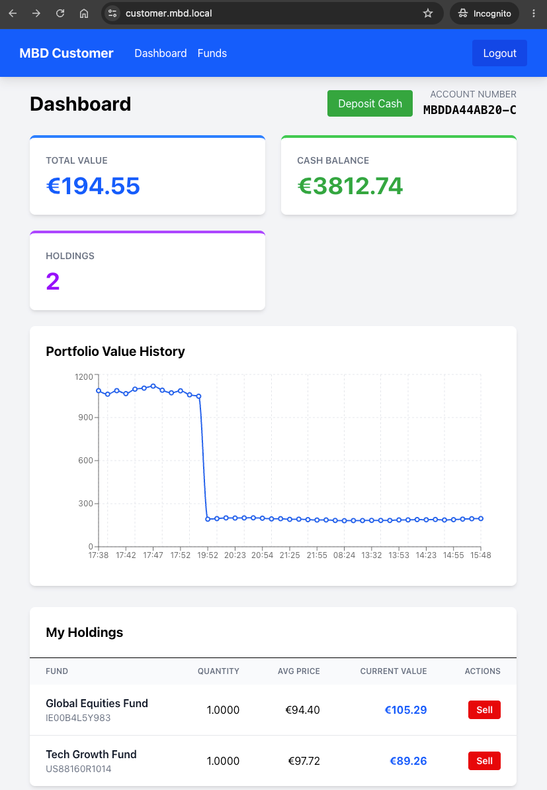
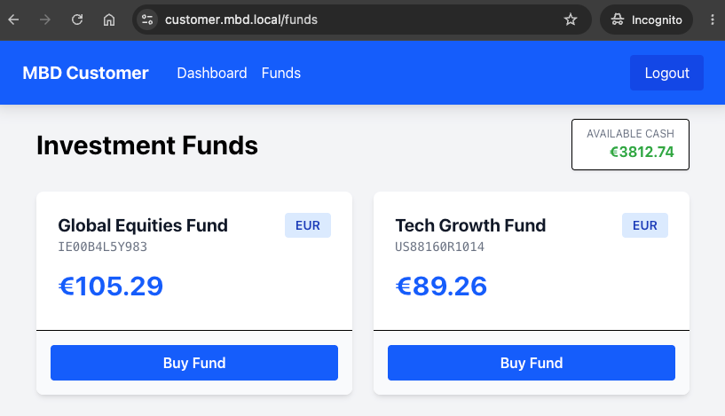
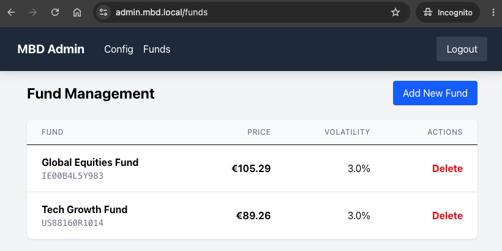
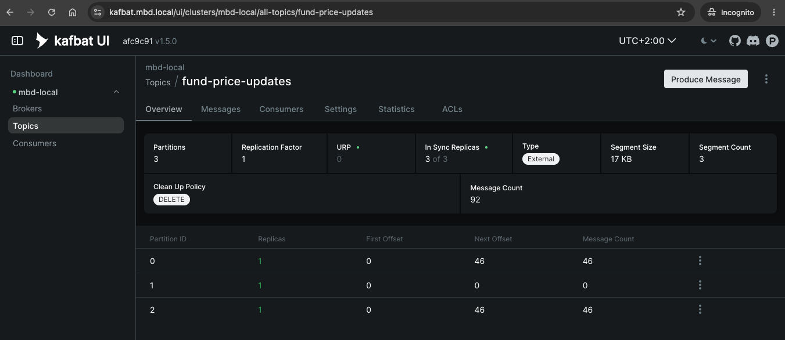
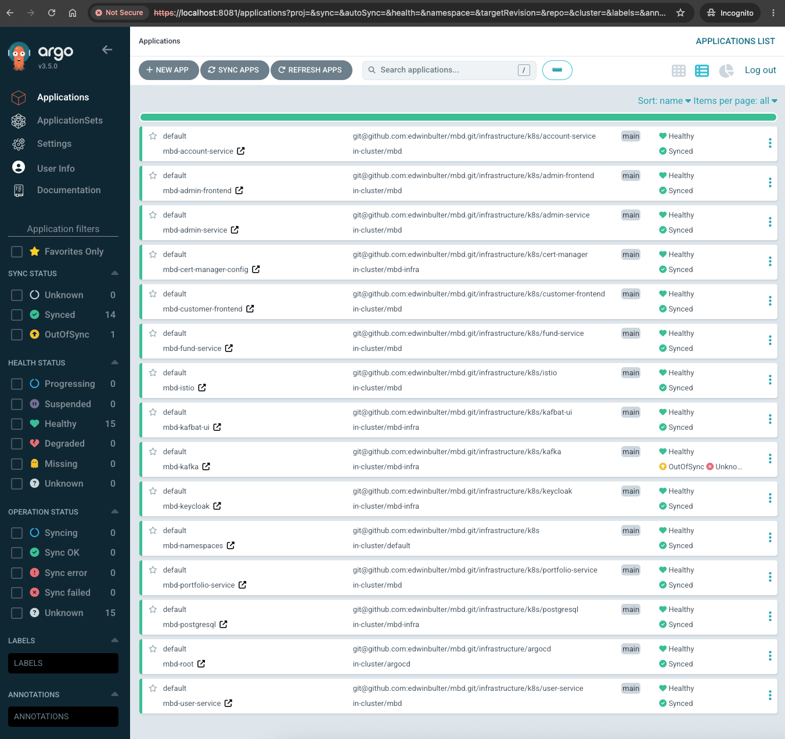

# MBD — My Bank Demo

MBD (My Bank Demo) is a demo investment-banking application. It is purely fictional and exists only for this learning project.

The demo lets a user register, open an investment account, deposit cash, buy and sell funds, and watch their portfolio value update over time as fund prices move. A separate admin frontend lets a bank employee manage funds and configure the price-update behaviour.

---

## Purpose

This demo exists to build hands-on experience with a specific tech stack:

- **Service mesh (Istio) for mTLS** — all service-to-service communication between the Kotlin microservices inside the Kubernetes cluster is encrypted and authenticated by Envoy sidecars, with no application code changes. The services use Kafka topics to stream fund price updates and config changes.
- **ArgoCD for GitOps** — the entire Kubernetes configuration (deployments, services, Istio resources, cert-manager, Keycloak, Kafka, PostgreSQL) lives in this Git repo and is reconciled by ArgoCD, making Git the single source of truth for the cluster state.
- **PKI with cert-manager** — a private certificate authority issues the TLS certificate for the Istio ingress gateway, so the `*.mbd.local` hostnames are served over HTTPS with a certificate that can be trusted by the browser.
- **Keycloak for SSO and JWT authentication** — both frontends sign in through a single Keycloak realm (single sign-on), and the resulting JWT is validated at the Istio edge and inside `admin-service`.

The backend services are written in **Kotlin** with **Spring Boot**, the frontends in **React + Vite + TypeScript**, and everything runs in a local **OrbStack** Kubernetes cluster (a lightweight alternative to Kind that uses native macOS virtualization for lower CPU and memory overhead).

---

## Functionality (with screenshots)

### Customer frontend (`https://customer.mbd.local`)

#### Dashboard — portfolio overview

After logging in via Keycloak and opening an investment account, the customer sees their dashboard: total portfolio value, cash balance, number of holdings, a portfolio value history chart (updates as fund prices move), and a holdings table with a Sell action per row.




#### Browse and buy funds

The Funds page lists all available funds with their current price. The user picks a quantity and buys a fund, which debits the account balance and creates/updates a holding.




### Admin frontend (`https://admin.mbd.local`)

The admin frontend requires the `admin` realm role (assigned via the Keycloak admin console).

#### Fund management

The admin can create new funds (name, ISIN, initial price, volatility) and delete existing funds. Changing the price-update config (volatility + frequency) publishes a config event to Kafka, which `fund-service` consumes and applies to all funds.




### Kafbat UI (`https://kafbat.mbd.local`)

A read-only Kafka UI for inspecting topics and messages — useful to see the `fund-price-updates` and `config-updates` events flowing through the system.



### ArgoCD UI (`https://localhost:8081`)

ArgoCD is the GitOps control plane — it watches this Git repo and continuously reconciles the Kubernetes cluster state with the manifests in `infrastructure/`. The UI shows all applications (namespaces, Istio, cert-manager, PostgreSQL, Kafka, Keycloak, Kafbat UI, and every backend/frontend service) and their sync status. When you push a change to the repo, ArgoCD automatically detects it and deploys it.



---

## Communication flows

### High-level architecture

```
                          ┌──────────────┐
                          │   Browser    │
                          └──────┬───────┘
                                 │ HTTPS (TLS by cert-manager)
                                 ▼
                          ┌──────────────┐
                          │  Istio       │
                          │  Gateway     │   mbd-gateway :443
                          └──────┬───────┘
                  ┌──────────────┼──────────────┬──────────────┐
                  ▼              ▼              ▼              ▼
        customer.mbd.local  admin.mbd.local  keycloak.mbd.local  kafbat.mbd.local
         (React SPA)         (React SPA)      (Keycloak)         (Kafka UI)
                  │              │              ▲                  ▲
                  │   Bearer JWT (Keycloak)     │                  │ (public)
                  ▼              ▼              │                  │
   ┌─────────────────────── mbd namespace ─────────────────────────────────────┐
   │  RequestAuthentication (JWT) + AuthorizationPolicy                        │
   │                                                                            │
   │  user-service  account-service  fund-service  portfolio-service  admin-service  │
   │      ▲             ▲                │                ▲              │           │
   │      │  Feign/mTLS  │  Feign/mTLS    │ Kafka          │ Feign/mTLS  │ Kafka     │
   │      └─────────────┘                ▼                │              │           │
   │                              ┌─────────────┐         │              │           │
   │                              │   Kafka     │─────────┘              │           │
   │                              │ fund-price- │  (mTLS)                 │           │
   │                              │  updates    │                        │           │
   │                              └─────────────┘                        │           │
   └─────────────────────────────────────────────────────────────────────────────────┘
                                 │ mTLS (DestinationRule)
                                 ▼
   ┌─────────────────────── mbd-infra namespace ──────────────────────┐
   │  PostgreSQL (shared DB)   Kafka   Keycloak + keycloak-postgresql │
   │  Kafbat UI                                                       │
   └──────────────────────────────────────────────────────────────────┘
```

### Frontend → backend flow

```
Browser
  │
  │  1. Open https://customer.mbd.local
  ▼
Istio Gateway (TLS terminate, mbd-tls-secret)
  │
  │  2. No JWT → redirect to Keycloak
  ▼
Keycloak (keycloak.mbd.local)
  │
  │  3. User logs in, gets JWT with roles claim
  ▼
Browser (has JWT)
  │
  │  4. GET /api/portfolio/1  (Authorization: Bearer <JWT>)
  ▼
Istio Gateway
  │
  │  5. VirtualService routes /api/portfolio → portfolio-service
  ▼
Envoy sidecar (validates JWT via RequestAuthentication)
  │
  │  6. AuthorizationPolicy allows (valid principal on /api/portfolio/*)
  ▼
portfolio-service
  │
  │  7. Feign calls (mTLS via DestinationRule ISTIO_MUTUAL)
  ├──► account-service  (get account balance)
  └──► fund-service     (get current fund price)
         │
         ▼
       Response flows back through sidecars + gateway → browser
```

### Backend services + Kafka flow

```
fund-service
  │
  │  PriceUpdateScheduler (every 1 min, per-fund frequency check)
  │  1. Reads funds from PostgreSQL
  │  2. Computes new price (random walk, bounded by volatility)
  │  3. Saves new price to PostgreSQL
  │  4. Publishes FundPriceUpdate to Kafka topic "fund-price-updates"
  ▼
Kafka (fund-price-updates topic)
  │
  │  mTLS between sidecars
  ▼
portfolio-service
  │
  │  FundPriceUpdateConsumer (KafkaListener)
  │  5. Receives FundPriceUpdate
  │  6. Finds all holdings for that fund
  │  7. Updates holding.currentValue = quantity * newPrice
  │  8. Creates PortfolioValueSnapshot (for the chart history)
  ▼
Next GET /api/portfolio/{accountId} reflects the new total value
```

### Admin config → Kafka → fund-service flow

```
admin-frontend
  │
  │  PUT /api/admin/config/price-update  (volatility, frequency)
  ▼
Istio Gateway → admin-service
  │
  │  Spring Security: hasRole('admin') check on JWT
  ▼
admin-service
  │
  │  1. Saves config to system_config table
  │  2. Publishes FundConfigDto to Kafka topic "config-updates"
  ▼
Kafka (config-updates topic)
  │
  ▼
fund-service
  │
  │  ConfigUpdateConsumer
  │  3. Updates per-fund volatility + updateFrequencyMinutes
```

### Buy / sell trade flow

```
customer-frontend
  │
  │  POST /api/portfolio/trade  { type: BUY | SELL, accountId, fundId, quantity }
  ▼
portfolio-service
  │
  │  BUY:
  │   1. fund-service → get current price
  │   2. account-service → check balance
  │   3. account-service → debit (negative deposit)
  │   4. upsert holding (weighted avg price)
  │
  │  SELL:
  │   1. fund-service → get current price
  │   2. check holding quantity >= sell quantity
  │   3. account-service → credit proceeds
  │   4. update or delete holding
  ▼
PostgreSQL (holdings, accounts, transactions)
```

---

## Tech stack at a glance

| Layer | Technology |
|-------|-----------|
| Backend | Spring Boot 3.1 + Kotlin 1.9, JDK 17, Gradle |
| Frontend | React 18 + Vite + TypeScript + TailwindCSS |
| Database | PostgreSQL 15 (shared, Flyway migrations per service) |
| Messaging | Apache Kafka 3.7 (KRaft mode, no Zookeeper) |
| Identity | Keycloak 23 (OIDC, JWT, SSO) |
| Service mesh | Istio (mTLS, JWT validation, authorization, ingress gateway) |
| PKI / TLS | cert-manager (self-signed CA → leaf cert for `*.mbd.local`) |
| GitOps | ArgoCD (app-of-apps, auto-sync, single source of truth) |
| Cluster | OrbStack (local Kubernetes, lightweight alternative to Kind) |

---

## Further reading

For in-depth explanations, see:

- [Architecture overview](doc/architecture.md)
- [Original plan and decisions](doc/plan-1.md)
- [Backend implementation guide](doc/backend-services-implementation.md)
- [Frontend implementation guide](doc/frontend-implementation.md)
- [Build & run operations](doc/operation-notes.md)
- [Backend testing guide](backend-testing.md)
- [Istio configuration README](infrastructure/k8s/istio/README.md)
- [cert-manager PKI README](infrastructure/k8s/cert-manager/README.md)
- Cluster setup with ArgoCD: [00-bootstrap-cluster](doc/infrastructure/00-bootstrap-cluster.md)
- Infrastructure setup steps: `doc/infrastructure/01-namespace-setup.md` … `07-cert-manager-setup.md`
